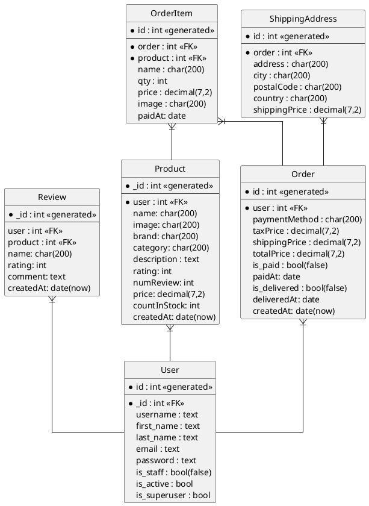
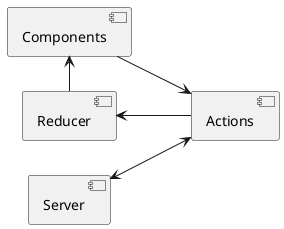
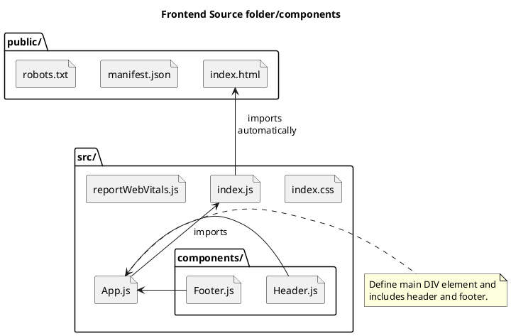

Ecommerce Udemy Course - Django and React
===

## Table of Contents

[TOC]

## Initial setup/configuration

Details on setting up local machine, including PyCharm, etc. for this course.

1. Create empty github repo at [djangoProject Github Repo](https://github.com/DavidHartman-Personal/djangoProject)
2. Clone newly created github repo in PyCharm
3. In PyCharm project, setup a venv for the project.
4. Add README.md and gitignore files to the repo and commit/push.

7/25 Steps:

1. Created Django Project using PyCharm with app named proshop.
2. Created new github repo by doing a VCS->Share on github, which created a new gh repo.
3. Created new React project named frontend in PyCharm outside of djangoProject. Used Windows version of node and
   npm/npx.
4. Tested and confirmed React app, closed PyCharm project and ran react within djangoProject.

2/3/2023 Notes
- New gh repo created https://github.com/DavidHartman-Personal/django-project-proshop-2.git
- Completed github repo for project: https://github.com/divanov11/proshop_django.git

### Project File/Folder Structure

The below sections show the various files and folders related to this project/course.  The current project is not 

#### Django Framework Files/Folders

Files/Folders that are specific to the Django Framework.

| Name                         | Description                                                                                                                                                                                           |
|:---------------------------- |:----------------------------------------------------------------------------------------------------------------------------------------------------------------------------------------------------- |
| djangoProject/               | Project Main folder                                                                                                                                                                                   |
| djangoProject/djangoProject/ | The Django App folder.  This is created when creating a new Django project and providing and App Name.                                                                                                |
| djangoProject/documentation/ | Contains documentation, including PlantUML files, etc.                                                                                                                                                |
| djangoProject/frontend/      | React Frontend folder, created with `npm create-react-app` command. See [Create React app](#Starting-the-Front-End---React) below                                                                     |
| djangoProject/proshop/       | This was created by the PyCharm wizard and represents a Django Application.                                                                                                                        df |
| djangoProject/resources/     | Contains resources that were imported from the original project.  This includes images, data structures, etc. used for testing, etc.                                                                  |

#### React Framework Files/Folders

These Files/Folders were created by running the `npm create-react-app` command. See [Starting the Front End](#Starting-the-Front-End---React) below.

| Name                    | Description                                                                                 |
|:----------------------- |:------------------------------------------------------------------------------------------- |
| frontend/               | Project Main folder                                                                         |
| frontend/node_modules/  | Created when running the npm command to create react application.                           |
| frontend/public/        | Folder container the public object as part of the front end                                 |
| frontend/src/           | Main source code folder for the react front end.                                            |
| frontend/src/components | Contains shared components used across most pages.  E.g. Footer.js, etc.                    |
| frontend/src/screens    | Contains the main core pages that make up the front end.  E.g. Cart.js, HomeScreen.js, etc. |
|                         |                                                                                             |

## Create github repo and Django Project in PyCharm

Created Django Python project in PyCharm with an application named django_react_ecommerce_2. Project name is django_react_ecommerce_2. Once created
the project can be uploaded to github by going to "VCS->Share on Github".
The github repo does not include a README.md, so sync this file with that repo by going to the drop down menu on the far right and choosing: "Versions and GitHub Sync".
This will create a README.md file.  Then switch back to PyCharm and do a "GIT->Update Project...". This will pull down the README.md file. 
Whenever changes to this README should be pushed to github choose the "Versions and GitHub Sync" option again.

Update at 9:08PM
Updated at 9:11PM

Newly created git repo: https://github.com/DavidHartman-Personal/django_react_ecommerce_2
Note pyton version/venv to use??
Completed live application:https://www.buildproshop.com/
Source code by chapter can be found at: https://www.buildproshop.com/#/sourcecode (Need to register and login.  See User->Source Code)

## Create React Project Using PyCharm Wizard and Windows node and npm/npx modules

In PyCharm a new React project was created (outside of the djangoProject) using the Windows version of node and npm/npx.
Using the WSL versions had 2 issues. The first was that the startup was slow and secondly, changes were not
automatically refreshed. I suspect that using babel and/or nodemon would help with that as WSL/Linux versions of the
node server on Windows are picking up real time changes to files.

Closed React project, opened frontend/packages.json file and choose "start" to run the React server to test locally.  
Once running, real time changes to the React app were working.

## Section 2: Starting the Front End

Prior to using PyCharm Project wizard to create React app, used WSL versions of node and npm/npx to create the React
application using the below steps. Due to issues with speed and making live changes, I used the steps noted above using
the PyCharm project wizard to create the react app using the Windows versions of node and npm/npx.

[Run npx command to create the react app](#Step 1 - Run npx command to create the react app)

### Section 2.5 - React Setup

#### Run npx command to create the react app

Run the following command to create the react app in the root project folder.

`npx create-react-app frontend`

This adds a new folder called frontend/

This can be tested/confirmed by starting up the react frontend server.

In the frontend/packages.json file, there are npm commands that are defined. These can be used as a starting point to
add a PyCharm run configuration. Note that usually the node command needs to be found and added (e.g. I used WSL and add
/usr/bin/node). At this point, there should be a Run option called "start". Starting this will startup the react server
and open the page (note, this takes a bit to startup).

```
cd frontend;
npm start;
```

This starts up the default application on port 3000.  localhost:3000
Output from npx command.

```
Success! Created frontend at /mnt/c/Users/david/Dropbox/Programming/Python/PyCharmProjects/django-react-ecommerce-course/frontend
Inside that directory, you can run several commands:

  npm start
    Starts the development server.

  npm run build
    Bundles the app into static files for production.

  npm test
    Starts the test runner.

  npm run eject
    Removes this tool and copies build dependencies, configuration files
    and scripts into the app directory. If you do this, you can’t go back!

We suggest that you begin by typing:

  cd frontend
  npm start

```

### Section 2: Starting the Front End - Cleanup frontend react components

Make updates to App.js, etc.

1. Copy resources/ folder from downloaded github repo to Django project.
2. Replace the favicon.ico in public/ with newly added resources/favicon.ico.
3. In index.html remove link to Learn React as well as the spinning icon.
4. From the src/ folder we can remove App.css, setupTests.js and App.test.js files.

### Section 2.6 - React-Bootstrap setup, header and footer components

Added components/Header.js and components/Footer.js and then import them into App.js

Import bootstrap from bootswatch.com to get style related components.

Download the bootstrap.min css file for Lux type from bootswatch and add to our src/ frontend folder.

Use npm install to add boot strap.

`npm install react-boostrap`
NOTE: Had to restart PyCharm due to 404 error

Component descriptions and code for react-bootstrap theme can be found
at [react-bootstrap](https://react-bootstrap.github.)
io/components/alerts

Add link to font-awesome from [cdnjs](https://cdnjs.com/) by searching for font-awesome and copying the link. This gives
us access to icons, etc. with the css file. For Font Awesome, adding an icon is done by adding the `<i>` tag with a
class name attribute. The classes for an icon require 2 entries. The first is for the style (solid, regular, Brands,
etc.) and the other for the icon name.  
So to add the shopping icon in the solid style we would add the following:

`<i className="fas fa-shopping-cart"></i>`

NOTE: fas is shorthand for fa-solid.

Add a shopping cart and user icons for the Navbar Cart and Login entries.

```htmlembedded

<Navbar.Collapse id="basic-navbar-nav">
    <Nav className="mr-auto">
        <Nav.Link href="/cart"><i className={"fas fa-shopping-cart"}></i>Cart</Nav.Link>
        <Nav.Link href="/login"><i className={"fas fa-user"}></i>Login</Nav.Link>
    </Nav>
</Navbar.Collapse>
```
The above React code would generate HTMl as follows:

```htmlembedded
<div class="navbar-collapse collapse" id="basic-navbar-nav">
    <div class="mr-auto navbar-nav">
        <a href="/cart" data-rr-ui-event-key="/cart" class="nav-link">
            <i class="fas fa-shopping-cart"></i>
            Cart
        </a>
        <a href="/login" data-rr-ui-event-key="/login" class="nav-link">
            <i class="fas fa-user"></i>
            Login
        </a>
    </div>
</div>
```
The below diagram represents the navigration bar that was added.

```plantuml
@startsalt
{
  {/ <b>ProShop | Cart | Login }
  '^ProShop^
}
@endsalt
```



### Section 2.7 - Home Screen Product Listing

Until we get the actual database linked into the project, we will use some dummy data that is accessed via a js constant array defined in the products.js file.

Copy products.js file to the frontend/src/ folder.  This contains a Object (JSON) js object that defines the products and their attributes.
Below is an example snippet of the product definitions:

```jsonld
const products = [
  {
    '_id': '1',
    'name': 'Airpods Wireless Bluetooth Headphones',
    'image': '/images/airpods.jpg',
    'description':
      'Bluetooth technology lets you connect it with compatible devices wirelessly High-quality AAC audio offers immersive listening experience Built-in microphone allows you to take calls while working',
    'brand': 'Apple',
    'category': 'Electronics',
    'price': 89.99,
    'countInStock': 10,
    'rating': 4.5,
    'numReviews': 12,
  },
    ...
]
```

The images folder contained in the course resources contains the sample product images defined in the products.js file.  Links to these images are defined in the product definition.

This images folder should be copied to public/images/.

#### Create HomeScreen Page

Create frontend/src/screens folder.  This will contain the various screens within the application.

Add HomeScreen.js where the main landing page/screen will be defined.  It will list the current products in a React-bootstrap grid system.  It will loop through all of the products defined in Products.js and print out information about the products.

The code for the HomeScreen page is stored in src/screens/HomeScreen.js.  This page includes a Listing of the current products being offered. We import the products constant (See Above) that is an array of objects.  The products.map function will apply a function for each object in the array.  
Using the [Layout Grid react-boostrap](https://react-bootstrap.github.io/layout/grid/.) we can add Rows and Columns to our page.

In our case, that function will create a Column entry for each element of the product object that is to be displayed.  There is as single row created and then for each entry in the products array a named arrow function will be performed.  The name of the arrow function can be referenced within the function.  So 

Column (not a row) is added.

```javascript
import React from 'react';
import { Row, Col } from 'react-bootstrap'
import products from '../products'
/**
 * We're using the Row and Col components from the react-bootstrap library to create a grid of products
 * @param props - This is the props object that is passed to the component.
 * @returns A div with a h1 and a row.
 */
function HomeScreen(props) {
    return (
        <div>
            <h1>Latest Products</h1>
            <Row>
                {products.map(product => (
                   <Col key={product._id} sm={12} md={6} lg={4} xl={3}>
                       <h3>{product.name}</h3>
                   </Col>
                ))}
            </Row>
        </div>
    );
}
export default HomeScreen;
```
#### Create Product Component

Next we create a new Component for our React Frontend app that will manage individual Products.  Since this component may be used in other areas within our application it gets created in the src/components/ folder.  This will then replace the products.map step created in the previous step.

The Product component will use the [react-boostrap a Card component](https://react-bootstrap.github.io/components/cards/). To create individual cards for each Product.  We create a exported function for Product that will return a Card.  This Card will have classes added that handle margins, padding, shape, etc.

To create a Card, we add a Card and include classes to modify it.  The modifier classes are the following:
my-3: This adds a margin of 3
p-3: This adds a padding amount of 3
rounded: This makes the card have slightly rounded corners.

Below is the Product component definition.  
```javascript
import React from 'react';
import { Card } from 'react-bootstrap'

function Product(props) {
    return (
        <Card className={"my-3 p-3 rounded"}>Product detail</Card>
    );
}

export default Product;
```
The HomeScreen screen is updated to import Product and update the map code to call the Product function for each entry in the products array.
The HomeScreen function in src/screens/HomeScreen.js should be updated to reference the newly created Product component.

```json
function HomeScreen(props) {
    return (
        <div>
            <h1>Latest Products</h1>
            <Row>
                {products.map(product => (
                   <Col key={product._id} sm={12} md={6} lg={4} xl={3}>
                       <Product product={product}
                   </Col>
                ))}
            </Row>
        </div>
    );
}
```

#### Add Product Screen/Page and Update Product Component to link to Product Screen/Page

Update the Product function in src/components/Product.js to create a link to the Product screen (not the Product component).  The props variable in the Product function should pass in the product object to be used in an HREF tag.  The created link should link to a product screen (not yet created) including a reference to the product._id.  The link is attached to a Card.Img component of the Card objectg.  This is similar to using the  tag in HTML.  The source will reference the image in the images folder, located in public/images/.  E.g. the first entry in the products array is defined as and the image key contains images/airpods.jpg, which is used as the source for the image:

```json
const products = \[  
  {  
    '_id': '1',  
    'name': 'Airpods Wireless Bluetooth Headphones',  
    'image': '/images/airpods.jpg',  
    'description':  
   'Bluetooth technology lets you connect it with compatible devices wirelessly High-quality AAC audio offers immersive listening experience Built-in microphone allows you to take calls while working',  
    'brand': 'Apple',  
    'category': 'Electronics',  
    'price': 89.99,  
    'countInStock': 10,  
    'rating': 4.5,  
    'numReviews': 12,  
  }
```

The updated Product function in src/components/Product.js should look as follows:

```jsx
/**
 * It returns a Card component with the className prop set to "my-3 p-3 rounded" and the children set to "Product"
 * @param props - This is the object that contains all the properties that were passed to the component.
 * @returns A Card component with the className of "my-3 p-3 rounded" and the text "Product"
 */
function Product({ product }) {
    return (
        <Card className={"my-3 p-3 rounded"}>
            <a href={`/product/${product._id}`}>
                <Card.Img src={product.image} />
            </a>
        </Card>
    );
}
```

Note that the backticks in the href link allow for variable substitution.  In this case we are adding the product._id value to the generated HTML.

This genarates the following HTML in the page:
```htmlembedded
<div class="col-xl-3 col-lg-4 col-md-6 col-sm-12">
    <div class="my-3 p-3 rounded card">
        <a href="/product/1">
            
        </a>
    </div>
</div>
```

Now the HomeScreen should appear as follows:


Next Update the Product function to include more details about the product, including the Product name, product image and ratings information.  The updated function creates a React Card Object.

Add an Image as part of the Cards definition.

```htmlembedded
<a href={`/product/${product._id}`}>
  <Card.Img src={product.image} />
</a>
```

Add to the Card Body the title of the Product including a HREF link to the product detail page (not yet created).

```htmlembedded
<a href={`/product/${product._id}`}>
  <Card.Title as={"div"}>
    <strong>{product.name}</strong>
  </Card.Title>
</a>
```

Next add a Card Text component that includes the Review rating information.

```htmlembedded
<Card.Text as={"div"}>
  <div className={"my-3"}>
   {product.rating} from {product.numReviews} reviews
  </div>
</Card.Text>
```

Add a Text Component to the Card that includes the products price.  This Card.Text component should be created as an h3 type so that is stands out from the other text.

```htmlembedded
<Card.Text as={"h3"}>
  ${product.price}
</Card.Text>
```
<a name="originalproductfunction">
The full updated Product function should be as follows:
```javascript=
 * It returns a Card component with the className prop set to "my-3 p-3 rounded" and the children set to "Product"
 * @param props - This is the object that contains all the properties that were passed to the component.
 * @returns A Card component with the className of "my-3 p-3 rounded" and the text "Product"
 */
function Product({ product }) {
    return (
        <Card className={"my-3 p-3 rounded"}>
            <a href={`/product/${product._id}`}>
                <Card.Img src={product.image} />
            </a>
            <Card.Body>
                <a href={`/product/${product._id}`}>
                    <Card.Title as={"div"}>
                        <strong>{product.name}</strong>
                    </Card.Title>
                </a>
                <Card.Text as={"div"}>
                    <div className={"my-3"}>
                        {product.rating} from {product.numReviews} reviews
                    </div>
                </Card.Text>
            </Card.Body>
        </Card>
    );
}
```
</a>

### Section 2.8 - Add the Rating Component for Products

This is section 2.8 where the rating components are added.  Within the Product.js page, we will add a componment within the Card.Text that will add the yet to be created Rating component.  

Within the Card.Text replace the line that printed the ratings with a new line to call the Rating Compomnent.  The Rating component adds the value equal to the product.rating as well as a text string to prints the number of reviews.  Additionally, we pass in a color which will be used to color the stars.  The hex value f8e825 is a shade of yellow.
The below snippet is included in the Product.js file.

```javascript
<Card.Text as={"div"}>
  <div className={"my-3"}>
  <Rating value={product.rating} text={`${product.numReviews} reviews`} color={'#f8e825'} />
</div>
</Card.Text>
```

Next we import the Rating component into the Product component.  Within the Rating.js script we export a function and the function should accept value, text and color as inputs.  The Rating function returns a DIV that has a className of 'rating'.  Within this DIV we will now add 5 stars that will be colored yellow based on logic added to the tags.  A SPAN block is created with an I styled tag added that will display font awesome icons for stars.  See above for the icons for Cart and Login where we used these font awesome icons previously.  The star will either be empty, fully colored or only half colored.  Within the I tag, the className will be determined based on if-then-else logic.  
The logic will add a full start if the value is >= to a whole number, a half star if the number is >= half of the previous whole number, otherwise an empty start will be added.
The I tag className logic will look as follows:

```javascript=
className={
    value >= 1
        ? 'fas fa-star'
        : value >= .5
           ? 'fas fa-star-half-alt'
           : 'far fa-star'
}
```

This logic is repeated with a span tag for each whole number up to 5 stars.  The final Rating function is as follows:

```javascript=
function Rating({value, text, color}) {
    return (
        <div className={"rating"}>
            <span>
              <i style={{color}} className={
                  value >= 1
                      ? 'fas fa-star'
                      : value >= .5
                          ? 'fas fa-star-half-alt'
                          : 'far fa-star'
              }>

              </i>
            </span>
            <span>
              <i style={{color}} className={
                  value >= 2
                      ? 'fas fa-star'
                      : value >= 1.5
                          ? 'fas fa-star-half-alt'
                          : 'far fa-star'
              }>

              </i>
            </span>
            <span>
              <i style={{color}} className={
                  value >= 3
                      ? 'fas fa-star'
                      : value >= 2.5
                          ? 'fas fa-star-half-alt'
                          : 'far fa-star'
              }>

              </i>
            </span>
            <span>
              <i style={{color}} className={
                  value >= 4
                      ? 'fas fa-star'
                      : value >= 3.5
                          ? 'fas fa-star-half-alt'
                          : 'far fa-star'
              }>

              </i>
            </span>
            <span>
              <i style={{color}} className={
                  value >= 5
                      ? 'fas fa-star'
                      : value >= 4.5
                          ? 'fas fa-star-half-alt'
                          : 'far fa-star'
              }>

              </i>
            </span>


        </div>
    );
}
```

The following line in Product.js file is removed.

```javascript=
{product.rating} from {product.numReviews} reviews
```

Next we include a final SPAN tag in Ratings.js file with the numeric value for the Rating as such.  The logic within this tag will include the text passed to the function if the value is non-null.

```htmlembedded=
<span>{text && text}</span>
```

Once this is included in the Rating.js file we will upate the main CSS file.  The logic implemented would modify the class rating (defined via `<div className={"rating"}>`) so that any SPAN tag has some margins added.  This will modify the look of the stars and the rating count within the Product card.

We also will adjust the spacing/margins of the h3 tags for all pages within the application.
    
The updates to the index.css file will look as follows:

```htmlembedded=
h3 {
    padding:1rem 0;
}
.rating span{
 margin:0.1rem;
}
```

### Section 2.9 - Implement the React Router

The following steps are completed as part of this lesson:
1. Install the react-router-dom and react-router-bootstrap packages in the frontend/ folder.
2. Import a Router, Routes and Route modules into the App.js function.
3. Replace the HomeScreen/ tag within the Container HTML tag to use a Route with a path of "/"
4. Create a ProductScreen.js file and logic and add new Route to App.js
5. Update the Product.js component to use React router Links instead of HTML anchor tags.
6. Update any other HREF links to use react Links

#### Install the react-router-dom and react-router-bootstrap packages in the frontend/ folder.
In the frontend/ folder, install the react-router-dom and react-router-bootstrap packages via npm as follows:

`npm install react-router-dom react-router-bootstrap`

#### Import a Router, Routes and Route modules into the App.js function.
Next we import BrowserRouter and Route from the react-router-dom package.  Add the following import into App.js

```javascript=
import {BrowserRouter as Router, Routes, Route} from 'react-router-dom'
```

#### Replace the HomeScreen/ tag within the Container HTML tag to use a Route with a path of "/"
Once added, we can replace the outer DIV tag within the return with a call to Router.  Additionally, we can replace any calls we had to other externally defined objects (e.g. HomeScreen) with a call to Route, passing in the component name.  Adding the "exact" keyword makes this Route definition only applicable to the current page.
Note that the syntax/usage differs from the videos as noted in one of the Q&A items.  The Q&A item suggests to import HashRouter instead of BrowserRouter and also imports Routes.  

So the updated App.js function looks as follows:

```htmlembedded=
<Router>
            <Header/>
            <main className={"py-3"}>
                <Container>
                    <Routes>
                        {" "}
                        <Route path="/" element={<HomeScreen/>}/>
                    </Routes>
                </Container>

            </main>
            <Footer/>
        </Router>
```
#### Create a ProductScreen.js file and logic and add new Route to App.js

Create src/screens/ProductScreen.js file and just print "Product" with a Div tag.

Next update App.js to include a new route for the ProductScreen.  Note that the Route call does not include exact as the URL will be dynamically genreated to include the Product Id.

```htmlembedded=
<Route path="/product/:id" element={<ProductScreen/>}/>
```

Adding this new Route and clicking on Product with an id of 1 will will direct traffic to http://localhost:3000/product/1 

#### Update the Product.js component to use React router Links instead of HTML anchor tags.

With the current logic in Product.js the HTML HREF to create link to a product detail page.  The preferred method is to replace these HREF links with React Router DOM Links.  This also will speed up the loading of the page as the browser does not load a new page, but just adds a new React component.

The original product compoment can be seen above in Section 2.7 - Home Screen Product Listing where the Product.js is initially created.

The src/components/Product.js will change to the following this:

```javascript=
import React from 'react';
import {Card} from 'react-bootstrap'
import {Link} from 'react-router-dom'
import Rating from './Rating'

/**
 * It returns a Card component with the className prop set to "my-3 p-3 rounded" and the children set to "Product"
 * @param props - This is the object that contains all the properties that were passed to the component.
 * @returns A Card component with the className of "my-3 p-3 rounded" and the text "Product"
 */
function Product({product}) {
    return (
        <Card className={"my-3 p-3 rounded"}>
            <Link to={`/product/${product._id}`}>
                <Card.Img src={product.image}/>
            </Link>
            <Card.Body>
                <Link to={`/product/${product._id}`}>
                    <Card.Title as={"div"}>
                        <strong>{product.name}</strong>
                    </Card.Title>
                </Link>
                <Card.Text as={"div"}>
                    <div className={"my-3"}>
                        <Rating value={`${product.rating}`} text={`${product.numReviews} reviews`} color={'#f8e825'} />
                    </div>
                </Card.Text>
                <Card.Text as={"h3"}>
                    ${product.price}
                </Card.Text>
            </Card.Body>
        </Card>
    );
}

export default Product;
```

#### Update any other HREF links to use react Links

In the previous section we replace HREF links to other pages within the app to use React router established routes and Link elements.  This included importing Link from react-router-dom.  Next we want to replace other HREF links that may not link to a defined React route.  For example, the main page logo has an HREF that simply redirects back to the home page.  

The Header.js component should be updated to use LinkContainers from react-router-bootstrap as below:

```javascript=
import React from 'react'
import {Navbar, Nav, Container} from 'react-bootstrap'
import {LinkContainer} from 'react-router-bootstrap'

function Header() {
    return (
        <header>
            <Navbar bg="dark" variant="dark" expand="lg" collapseOnSelect>
                <Container>
                    <LinkContainer to={"/"}>
                        <Navbar.Brand>ProShop</Navbar.Brand>
                    </LinkContainer>
                    <Navbar.Toggle aria-controls="basic-navbar-nav"/>
                    <Navbar.Collapse id="basic-navbar-nav">
                        <Nav className="mr-auto">
                            <LinkContainer to={"/cart"}>
                                <Nav.Link><i className={"fas fa-shopping-cart"}></i>Cart</Nav.Link>
                            </LinkContainer>
                            <LinkContainer to={"/login"}>
                                <Nav.Link><i className={"fas fa-user"}></i>Login</Nav.Link>
                            </LinkContainer>
                        </Nav>
                    </Navbar.Collapse>
                </Container>
            </Navbar>
        </header>
    )
}

export default Header
```

### Section 2.10 - Product Details Screen

This section will focus on building out the Product detail page.  This includes importing/using React router DOM and React Bootstrap components within the Product detail page.

1. Import react-router-dom, react-boostrap, Rating componment and the Products array
2. Create constant that will contain the specific product from the imported array
3. Create/Add detailed elements on Product detailed page

#### Import react-router-dom, react-boostrap, Rating componment and the Products array

Add imports to ProductScreen.js as below:

```javascript=
import { Link, UseParams } from 'react-router-dom'
import { Row, Col, Image, ListGroup, Button, Card } from 'react-bootstrap'
import Rating from '../components/Rating'
import products from '../products'
```

NOTE: The UseParams was needed for the latest react-router-dom module.  Previously, this was not imported/used.

#### Create constant that will contain the specific product from the imported array

When the route for the ProductScreen was defined on the main App.js page, the path included a parameter to be passed to the component.  This was named id.

```javascript=
<Route path="/product/:id" element={<ProductScreen />} />
```
This id can be accessed within the function by accessing the params that were passed in.

```javascript=
function ProductScreen() {
    const match = useParams();
    const product = products.find((p) => p._id == match.id);
    return (
        <div>
            {product.name}
        </div>
    );
}
```

#### Create/Add detailed elements on Product detailed page

This step involves adding the various JavaScript/HTML elements for the Product detail page.  The Product Detail page will have the following items.

- Link to Go Back to the main/home Page
- A single Row Element containing 3 Column elements.
- Column 1 will be an image of the Product
- Column 2 will contain a ListGroup with 4 Items: Product Image, product name, price and rating information
- Column 3 will contain a Card element that will list the Price, The inventory Status and include an Add to Cart button.

Add a Link object to the Product detail page that is styled as a button and has a margin of 3 by adding the following:

```javascript
<Link to='/' className='btn btn-light my-3'>Go Back</Link>
```

The next element is a Row Element containing 3 Columns of information about the Product.

Column 1 is an image of the product, which is located in the product.image value of the Product elements.  E.g. the iPhone 11 product has an image value of 'image': '/images/phone.jpg'.  Not sure what the fluid setting does.  

```javascript
<Col md={6}>
    <Image src={product.image} alt={product.name} fluid />
</Col>
```

The second Column contains details about the product wich is contained in a ListGroup Element.  The first ListGroup item is the name of the Product.

```javascript
<Col md={3}>
   <ListGroup variant={"flush"}>
    <ListGroup.Item>
     <h3>{product.name}</h3>
    </ListGroup.Item>
   </ListGroup>
</Col>
```
The second ListGroup item includes the Rating details.  This is added by importing the Rating component that was created previously.

```javascript
<ListGroup.Item>
  <Rating value={product.rating} text={`${product.numReviews} ratings`} color={'#f8e825'}/>
</ListGroup.Item>
```
Next the Price is added.
```javascript
<ListGroup.Item>
  Price: ${product.price}
</ListGroup.Item>
```

The final element in the ListGroup is a description of the Product.
```javascript
<ListGroup.Item>
  Description: {product.description}
</ListGroup.Item>
```

The 3rd column will include the Price, the inventory status (In Stock vs Out of Stock) and an Add to Cart button. This will be done by adding a Card element that contains a ListGroup Item in the ListGroup is a single Row Element with 2 Column Elements. 
The first ListGroup item will show the price of the product.

```javascript
<ListGroup.Item>
 <Row>
  <Col>Price:</Col>
  <Col>
   <strong>${product.price}</strong>
  </Col>
 </Row>
</ListGroup.Item>
```

Next the inventory status is displayed that includes logic based off of the countInStock attribute of the product (See the Products.js file).  If the countInStock is greater than 0 then "In Stock" should be displayed, otherwise "Out of Stock" should be displayed.

```javascript
<ListGroup.Item>
 <Row>
  <Col>Status:</Col>
  <Col>
     {product.countInStock > 0 ? 'In Stock' : 'Out of Stock'}
  </Col>
 </Row>
</ListGroup.Item>
```
This can be confirmed by updating the countInStock value to 0 for an item in the Products.js file and then going to that products detail page.  

The final ListGroup item will be a button that is as wide as the previous ListGroup items, each of which included a Row with 2 Columns.  We use the imported Button element to create the button. The button should also be disabled if the countInStock is 0.  This is done by adding the disabled flag and settings is value to the boolean check of countInStock being equal to 0.

```javascript
<ListGroup.Item>
 <Row>
   <Button className={'btn-block'} disabled={product.countInStock == 0} type='button'>Add to Cart</Button>
 </Row>
</ListGroup.Item>
```

This completes the setup of the Front end, including the react components.  

## Section 3: Serving and Fetching Data From Django

Backend setup/architecture


Eventually the React front end will be deployed and live on the Django server itself instead of running off of port 3000.  

### Section 3.11 - Frontend/Backend Workflow - API Routes

The following API Routes will be setup as part of the building out of the backend.

| Method | Route                   | Description                                |
| ------ | ----------------------- | ------------------------------------------ |
| GET    | /api/products           | Gets all Products                          |
| GET    | /api/procuts/25         | Gets an individual product based on the ID |
| POST   | /api/products/create    | Creates a new products                     |
| PUT    | /api/products/update/25 | Updates a single product based on the id   |
| DELETE | /api/products/delete/25 | Deletes a single product based on the id   |

### Section 3.12 - Building the backend

I used PyCharm to do the setup of the Django project, but the below steps would create the Django project from scratch and is detailed in the Section 3: Serving and Fetching Data from Django:Building the Backend video.

1. Setup a venv using pip install venv
2. Active the new venv by calling `venv/scripts/activate`
3. Run `pip install django` to install Django
4. Run `django-admin startproject backend` to create a project named "backend"
    1. This setups a backend/ folder, which contains manage.py as well as a backend/ sub-folder.
    2. See the section Django Framework Files/Folders above for the folder layout and descriptions.
7. Confirm the Django server was setup correctly by running `python manage.py runserver` command.

In PyCharm, the above steps were completed by using the Django project template to setup a new project.  A run configuration is also created and can be used to test that Django is setup correctly.  

#### Configure a Django Application

Stop the server if it is not already stopped.  Django uses individual apps to separate components (e.g. Products in one application and Users in another application).  For this project we are creating one application.

In the backend folder, run the following command to create the app if not already created.  PyCharm already did this for us and the project was named proshop/.

The application related folders/files are structured as follows:

| Name                | Description                               |
| ------------------- | ----------------------------------------- |
| proshop/            | The proshop/ Django app base folder       |
| proshop/migrations/ | Folder that contains migration resources. |
| proshop/__init__.py | Standard Python init                      |
| proshop/admin.py    | Application admin resources               |
| proshop/models.py   | Application models resources               |
| proshop/tests.py    | Application test resources               |
| proshop/views.py    | Application views resources               |

To make DJango aware of the newly created app.  We need to update the Django Server settings to note the newly installed application.

The djangoProject/ folder contains the Django settings as defined in the djangoProject/settings.py

The following line is added to the INSTALLED_APPS array in the settings.py and should look as follows.  The name of the application is based on the class defined in the proshop/app.py file.  In our case that class was named ProshopConfig.

```python=
# Application definition

INSTALLED_APPS = [
    'django.contrib.admin',
    'django.contrib.auth',
    'django.contrib.contenttypes',
    'django.contrib.sessions',
    'django.contrib.messages',
    'django.contrib.staticfiles',
    'proshop.apps.ProshopConfig',
]
```
#### Add a new View to the Django Application and update URLs

Next we setup views to start configuring the project and routes.  For this couse, function based views are to be used, but class based views could be used as well.  The function based views keeps all of the logic in the same place.

Go into proshop/views.py and create a function called getRoutes that will provide a way to get the possible routes for the application.  This looks as below:

```python=
from django.shortcuts import render
from django.http import JsonResponse

# Create your views here.

def getRoutes(request):
    return JsonResponse('Hello', safe=False)

```

Now we need to create/update the urls.py file for the application as well as for the Django server itself.  Modify the proshop/urls.py file to look as below.

```python=
from . import views
from django.urls import path

urlpatterns = [
    path('', views.getRoutes, name="routes"),
]
```

The above addition will direct any incoming traffic to the "root" or "home" URL of the application to call getRoutes.  Additionally, we need to add an entry to the urlpatterns array of the Django server itself.  To do this we import and use include, referencing the application and view to call.  In this case the application/view to call is proshop.urls.  The updated djangoProject/urls.py looks as follows:

```python=
from django.contrib import admin
from django.urls import path, include

urlpatterns = [
    path('admin/', admin.site.urls),
    path('', include('proshop.urls')),
]

```

#### Complete getRoutes view

Add an array that contains the valid routes and also update the urlpatterns to setup the convention for routing api requests.  

The routes array should be added to the getRoutes view function.  The getRoutes function in views.py will look as follows.

```python=
from django.shortcuts import render
from django.http import JsonResponse

# Create your views here.

def getRoutes(request):
    routes = [
        '/api/products/',
        '/api/products/create/',
        '/api/products/upload/',
        '/api/products/<id>/reviews/',
        '/api/products/top/',
        '/api/products/<id>/',
        '/api/products/delete/<id>/',
        '/api/products/<update>/<id>/',
    ]
    return JsonResponse(routes, safe=False)
```

Next we want to modify the urlpatterns to include a pattern of "api", so that when the url http://localhost:8000/api is accessed, the call gets routed to the proshop/getRoutes function.  The updated djangoProject/urls.py file will look as follows:

```python=
from django.contrib import admin
from django.urls import path, include

urlpatterns = [
    path('admin/', admin.site.urls),
    path('api/', include('proshop.urls')),
]
```
The proshop/urls.py file changes from above will call getRoutes based on its urlpatterns array.

Now when going to http://127.0.0.1:8000/, there will be a "Page Not Found" error.  Going to http://127.0.0.1:8000/api/ will return the call to getRoutes.

Next we create the logic to handle the '/api/products/' route so that when we go to http://127.0.0.1:8000/api/products/ we have logic executed.  We want to return the list of test products that we used for the frontend work.  To do that we copy the products.js JavaScript file from the frontend/ folder and then convert the contained data into a Python dictionary.  This is done by removing the const keyword and export command.  This is then a Python dictionary.

`cp frontend/src/products.js proshop/products.py`

#### Add getProducts view and URL

Create a function that will import the products dictionary and return the object as json using a function named getProducts.  The function will look as below:

```python=
from .products import products
def getProducts(request):
    return JsonResponse(products, safe=False)
```

Next we update the proshop URL patterns to include a route for products/ which will call the getProducts function.  The updated proshop/urls.py urlpatterns array will look as follows:

```python=
urlpatterns = [
    path('', views.getRoutes, name="routes"),
    path('products/', views.getProducts, name="products"),
]
```
Once this is complete accessing http://127.0.0.1:8000/api/products/ will return the list of products.


#### Adding the Django REST Framework

We will use the [Django REST Framework][Django REST Framework] to setup a more appropriate/efficient REST API.

Install the Django REST Framework

`pip install djangorestframework`

I did this manually via the PyCharm Settings dialog.  

Next we add an entry into the INSTALLED_APPS array in the backend's settings.py file.

` 'rest_framework',`

For this tutorial we are using REST Function views instead of classes.  The API refence information can be found at [Function Based Views](https://www.django-rest-framework.org/api-guide/views/#function-based-views).
We will use an API view decorator as well as the REST framework response instead of the Json response in the views.py.

```python=
from django.http import JsonResponse
from rest_framework.decorators import api_view
from rest_framework.response import Response

from .products import products

# Create your views here.

@api_view(['GET'])
def getRoutes(request):
    routes = [
        '/api/products/',
        '/api/products/create/',
        '/api/products/upload/',
        '/api/products/<id>/reviews/',
        '/api/products/top/',
        '/api/products/<id>/',
        '/api/products/delete/<id>/',
        '/api/products/<update>/<id>/',
    ]
    return Response(routes)
```

Now when we access https://127.0.0.1:8000/api we get a formatted page of the API response, which allows for adjusting the output type, etc.  Note that the api_view decorator needs to be used in order to use the rest_framework Response function.  In the above we are only allow GET HTTP calls for getRoutes.
Adjust the getProducts view to use the rest_framework functions as well.

```python=
@api_view(['GET'])
def getProducts(request):
    return Response(products)

```

#### Add getProduct view to get a single product.

Add entry to urlpatterns[] array.  This pattern should be added to the proshop/urls.py file and also be configured to accept a paramter called `pk` and should call the getProduct view.
The updated urlpatterns array looks as follows:
```python=
urlpatterns = [
    path('', views.getRoutes, name="routes"),
    path('products/', views.getProducts, name="products"),
    path('product/<str:pk>', views.getProduct, name="product"),
]
```

Create a new view called getProduct which takes in an id as the parameter (named pk) and returns a single product.

```python=
@api_view(['GET'])
def getProduct(request, pk):
    product = None
    for i in products:
        if i['_id'] == pk:
          product = i;
          break;
    return Response(product)
```


### Section 3.13 - Fetching Data in the Frontend

Now we go back to the frontend react components and add the logic to use the API calls.  

#### Install/Configure Axios

Use `npm install axios` command to install axios.

Start the React server as before.  The current home page contains the products from the static file containing the products.  We want to modify that to use axios.

We will use UseState and useEffect functions from React to set the products array up the first time.

The `const [products, setProducts] = useState([])`


See [React useState](https://reactjs.org/docs/hooks-reference.html#usestate) for more details.  The line above will initially set the products to an empty array via the useState([]) assignment.  [useEffect()](https://reactjs.org/docs/hooks-reference.html#useeffect) accepts a function that contains code that is possibly effectful.  So the following lines will update the products array via a useState call to setProducts. The second parameter to useEffect() tells the useEffect to be called only when the array is empty(which array?!?)

```javascript=
useEffect(()=> {
        async function fetechProducts() {
            const { data } = await axios.get('http://127.0.0.1:8000/api/products')
            setProducts(data)
        }
        fetechProducts()
    }, [])
```

The updated HomeScreen.js file looks as below.

```javascript=
import React, { useState, useEffect } from 'react';
import { Row, Col } from 'react-bootstrap'
// Import the Product Component
import Product from '../components/Product'
import axios from 'axios'

// This is an array of objects used for testing
//import products from '../products'


/**
 * We're using the Row and Col components from the react-bootstrap library to create a grid of products
 * @param props - This is the props object that is passed to the component.
 * @returns A div with a h1 and a row.
 */
function HomeScreen(props) {
    const [products, setProducts] = useState([])
    useEffect(()=> {
        async function fetechProducts() {
            const { data } = await axios.get('http://localhost:8000/api/products')
            setProducts(data)
        }
        fetechProducts()
    }, [])

    return (
        <div>
            <h1>Latest Product Listing</h1>
            <Row>
                {products.map(product => (
                   <Col key={product._id} sm={12} md={6} lg={4} xl={3}>
                       <Product product={product} />
                   </Col>
                ))}
            </Row>
        </div>
    );
}

export default HomeScreen;
```
We will get a CORS error until we update the Django server to allow the calls from the source IP.

1. Install django-cors-headers on the server using either pip install or PyCharm.
2. Configure the CORS header modules

The details on setting up the CORS header can be found at [pypi.org - Django cors headers](https://pypi.org/project/django-cors-headers/)

Add corsheaders to INSTALLED_APPS array.


```python=
INSTALLED_APPS = [
    'django.contrib.admin',
    'django.contrib.auth',
    'django.contrib.contenttypes',
    'django.contrib.sessions',
    'django.contrib.messages',
    'django.contrib.staticfiles',

    'rest_framework',
    'corsheaders',

    'proshop.apps.ProshopConfig',
]

```

Add Middleware cors component.

```python=
MIDDLEWARE = [
    'corsheaders.middleware.CorsMiddleware',
    'django.middleware.security.SecurityMiddleware',
    'django.contrib.sessions.middleware.SessionMiddleware',
    'django.middleware.common.CommonMiddleware',
    'django.middleware.csrf.CsrfViewMiddleware',
    'django.contrib.auth.middleware.AuthenticationMiddleware',
    'django.contrib.messages.middleware.MessageMiddleware',
    'django.middleware.clickjacking.XFrameOptionsMiddleware',
]

```
Configure allowable URLs.  For now we will allow all URL's but will change this later in production.

```python
CORS_ALLOW_ALL_ORIGINS = True
```
We do need to make sure the call to the server is using localhost and not the 127 IP address.

Update the React configuration to use a proxy server/port.  This will allow us to simplify the URL needed when accessing the API.  

Instead of 
`const { data } = await axios.get('http://localhost:8000/api/products')`
We can use
`const { data } = await axios.get('/api/products')`

Update the frontend/package.json file to include the following as the second line.

`  "proxy": "http://localhost:8000",`

#### Update the ProductScreen React script to use Axios and our API call

Copy the paste the imports and main code from the HomeScreen.js script to the ProductScreen.js file.

Note that useParam's is different from the udemy lesson video as we need to explicitly set a const to get the parameters.
The updated ProductScreen function looks as follows:

```javascript=
    const match = useParams();
    const [product, setProduct] = useState([])
    useEffect(()=> {
        console.log('Executing useEffect for Single Product')
        async function fetechProduct() {
            const { data } = await axios.get(`/api/products/${match.id}`)
            setProduct(data)
        }
        fetechProduct()
    }, [])

```

### Section 3.14 - Database setup and admin Panel

This step involves setting up the database tables, including the migration of the Django objects (Views) that will work on top of these database structures.

#### Run Initial Django Migrations

Run the migration process for Django.  In the root directory (i.e. djangoProject), run the following to perform the initial migrations.

`python manage.py migrate`

Create an intial superuser as well within the DJango user table.

In the same directory, run the following to create a user within Django.

`python manage.py createsuperuser`

To see the details of the user, go into the Django admin panel @ http://localhost:8000/admin

Default user id to dhartman.

#### Create inital proshop models

Within the models.py file, create classes that will create tables.

First import the default User table from Django.

`from django.contrib.auth.models import User`

Create a Class for the Product table and add Django model attributes.  The Product class will look as follows.  Setting the addming the __str__ function and returning self.name will show the product name in the admin panel for each entry in the table (instead of something like Product(0)).

```python=
from django.db import models
from django.contrib.auth.models import User

# Create your models here.

class Product(models.Model):
    user = models.ForeignKey(User, on_delete=models.SET_NULL, null=True)
    name = models.CharField(max_length=200, null=True, blank=True)
    # image =
    brand = models.CharField(max_length=200, null=True, blank=True)
    category = models.CharField(max_length=200, null=True, blank=True)
    description = models.TextField(null=True, blank=True)
    rating = models.DecimalField(max_digits=7, decimal_places=2, null=True, blank=True)
    numReviews = models.IntegerField(null=True, blank=True, default=0)
    price = models.DecimalField(max_digits=7, decimal_places=2,null=True, blank=True)
    countInStock = models.IntegerField(null=True, blank=True, default=0)
    createdAt = models.DateTimeField(auto_now_add=True)
    _id = models.AutoField(primary_key=True, editable=False)
    
    def __str__(self):
        return self.name
```

Next we need to prepare and run migrations to actually create the Product model.
Run `python manage.py makemigrations` to prepare the migration and then run `python manage.py migrate` to migrate the changes.
Next, to make the table visible in the Django admin panel, we need to register the table.  Update admin.py to import and then register the Product model.

```python=
from django.contrib import admin
from .models import Product

# Register your models here.
admin.site.register(Product)
```
Go to the admin panel and manually add a Product to confirm it works as expected.

### Section 3.15 - Modeling our Data

Add remaining model items as noted in the Data Model and migrate these objects.



Once these items are added to models.py perform the following steps:

1. Add model objects to admin site
2. run makemigrations
3. run migration

The updated admin.py looks as follows: 

```python=
from django.contrib import admin
from .models import *


# Register your models here.
admin.site.register(Product)
admin.site.register(Review)
admin.site.register(Order)
admin.site.register(OrderItem)
admin.site.register(ShippingAddress)
```
The updated models.py can be reviewed in github under the following [commit](https://github.com/DavidHartman-Personal/djangoProject/commit/4338fc1e82749644424bd5ba2549f2459a8bf6cf). 


### Section 3.16 - Product Image Field

The image field within the Product model needs to be configured as a models.ImageField.  In order to use models.ImageField, pillow needs to be installed/configured.

Update the image field under the Product model.
```python
image = models.ImageField(null=True, blank=True)
```
### Section 3.17 - Static Files

Create a static files folder as the default location that files are saved to is the root folder for the project.  For example, if using the Django admin panel to add a Product, one can choose a image file to upload and save to the product.  This image file is stored in the project root directory.

Create a new folder and sub-folder under the root djangoProject folder for static files and images.

mkdir static
mkdir static/images

Update the Django server settings.py to include additional infromation regarding the static file locations and where to save uploaded images in the future.

The updated settings.py has the below new information:

```python!
STATIC_URL = 'static/'
MEDIA_URL = '/images/'

STATICFILES_DIRS = [
    BASE_DIR / 'static'
]

MEDIA_ROOT = 'static/images'
```

Next the urls.py file needs to be updated to include a link to the images URL. The updated urls.py looks as follows:

```python!
from django.contrib import admin
from django.urls import path, include

from django.conf import settings
from django.conf.urls.static import static

urlpatterns = [
    path('admin/', admin.site.urls),
    path('api/', include('proshop.urls')),
]

urlpatterns += static(settings.MEDIA_URL, document_root=settings.MEDIA_ROOT)

```

### Section 3.18 - Serializing Data
Currently products are retrieved through API calls to the Django proshop application.  The product data is stored locally on the Django server in products.py.  This section will change that to use the sqlite database.
In the views.py file, update the getProducts API to make a call to the Product model.  Using Product.objects.all(), we will retrieve all products.  This will not work with just a call to the Product model as the data needs to be serialized.

```python=
@api_view(['GET'])
def getProducts(request):
    products = Product.objects.all()
    return Response(products)
```
In order to return the data properly, we need to create a serializer for each Model we want to work with.
Create serializers.py and Add a ProductSerializer class as noted below.  In a serializer, a Meta class must be created and needs to have at least 2 attributes, model and fields.  model is the name of the model and fields is an array of the fields to serialized and/or made availble.  If all fields are to be included, we can use the __all__ variable as below.

```python=
from rest_framework import serializers
from django.contrib.auth.models import User
from .models import Product

class ProductSerializer(serializers.ModelSerializer):
    class Meta:
        model = Product
        fields = '__all__'
```
Once created, we import the ProductSerializer into the views.py and use that to serialize and return the product data in the api calls.  Product.objects.all() will return all data records.

```python=
from .serializers import ProductSerializer
@api_view(['GET'])
def getProducts(request):
    products = Product.objects.all()
    serializer = ProductSerializer(products, many=True)
    return Response(serializer.data)
```
Now when we call the getProducts API, the data returned will be from the database.  Update the getProduct API as well as below.  Use the Model.objects.get() function to get a single data record. 

```python=
@api_view(['GET'])
def getProduct(request, pk):
    product = Product.objects.get(_id=pk)
    serializer = ProductSerializer(product, many=False)
    return Response(serializer.data)
```
Once the above is complete we have not connected in our product data from the sqlite database.  We can add additional products for the follow up lessons.  

## Section 4: Implementing Redux for State Management

[Redux](https://redux.js.org) is a predictable state container for JS Apps.  
It helps you write applications that behave consistently, run in different environments (client, server, and native), and are easy to test. On top of that, it provides a great developer experience, such as live code editing combined with a time traveling debugger.

### Section 4.19 - An Overview of Redux

2 Main states
Global/Application level state (e.g. Authenticated User, Shopping Cart, Orders)

The whole global state of your app is stored in an object tree inside a single ***store***
The only way to change the state tree is to create an **action**, an object describing what happened, and ***dispatch*** it to the store.
To specify how state gets updated in response to an action, you write pure ***reducer*** functions that calculate a new state based on the old state and the action.


Component level state (e.g. Screens, Header, Footer, Products)

Reducers: A function that takes a current state value and an action object describing "what happened", and returns a new state value. A reducer's function signature is: (state, action) => newState

Actions objects represent the instention to change state

Action creater function getProduct, dispatch action to reducer which has a payload that contains the data.

See the [Redux Glossary](https://redux.js.org/glossary) for term definitions.

Diagram



### Section 4.20 - Create Redux Store

Install/Enable Redux Dev tools in browser if not already enabled and perform install/setups of redux.

in djangoProject/frontend, run an install of redux, react-redux, redux-thunk

`npm install redux react-redux redux-thunk redux-devtools-extensions`

Add a file under src/ named store.js and configure Redux store resources.  frontend/src/store.js should look as follows.

```javascript=
import { createStore, combineReducers, applyMiddleware } from 'redux'
import thunk from 'redux-thunk'
import { composeWithDevTools } from 'redux-devtools-extension'


const reducer = combineReducers({})

const initialState = {}

const middleware = [thunk]

const store = createStore(reducer, initialState, composeWithDevTools(applyMiddleware(...middleware)))

export default store
```

Next update index.js to import the newly created store object and also use a Redux Provider.  The updated index.js looks as follows.

```javascript=
import React from 'react';
import ReactDOM from 'react-dom/client';
import './index.css';
import './bootstrap.min.css'
import App from './App';
import reportWebVitals from './reportWebVitals';
import { Provider } from 'react-redux'
import store from './store'

const root = ReactDOM.createRoot(document.getElementById('root'));
root.render(
  <Provider store={store}>
    <App />
  </Provider>
);

// If you want to start measuring performance in your app, pass a function
// to log results (for example: reportWebVitals(console.log))
// or send to an analytics endpoint. Learn more: https://bit.ly/CRA-vitals
reportWebVitals();
```

### Section 4.21 - Product List Reducer & Action

In this section we create the various Redux components to manage the Products store objects.  This includes configuring the Redux store, creating reducers and actions.  


Create constants/ folder and within that folder create productConstants.js.  This file will contain exported Prouct Listing actions.

```javascript=
export const PRODUCT_LIST_REQUEST = 'PRODUCT_LIST_REQUEST'
export const PRODUCT_LIST_SUCCESS = 'PRODUCT_LIST_SUCCESS'
export const PRODUCT_LIST_FAIL = 'PRODUCT_LIST_FAIL'
```

Create actions/ folder and within that folder create productActions.js.
Create a function listProducts() that is an ansync arrow function.  This function will use the passed in dispatch resource to invoke a PRODUCT_LIST_REQUEST action, then use axios to retrieve data from the backend api.  If the backend API returns data the PRODUCT_LIST_SUCCESS action is invoked. If there is an error, then the PRODUST_LIST_FAIL action is invoked.  

Create reducers/ folder and within that folder create productReducers.js
The product reducer productListReducer function is created and taking in the current state and an action/payload will update product state resources in the store. 

### Section 4.22 - Bringing Redux Intro Home Screen

Now that we have the Redux store, actions and reducers defined to manage the product list within the store, we can replace the HomeScreen() function in HomeScreen.js to import the listProducts() Redux action and dispatch actions to update the product list and then retrieve the updated product list from the store.  Once the productList store object is updated, we select that data and use it to build the product listing on the HomeScreen.

The updated HomeScreen function looks as follows once the useEffects code that called the backend API to get the list of products is replaced with a call to dispatch the Redux product actions.

```javascript=
function HomeScreen(props) {
//    const [products, setProducts] = useState([])
    const dispatch = useDispatch()

    useEffect(()=> {
      dispatch(listProducts())
    }, [])

    const products = []
    return (
        <div>
            <h1>Latest Product Listing</h1>
            <Row>
                {products.map(product => (
                   <Col key={product._id} sm={12} md={6} lg={4} xl={3}>
                       <Product product={product} />
                   </Col>
                ))}
            </Row>
        </div>
    );
}
```
If you view the home screen now, we can see in the browser developer tools that the productList Redux store has an updated products array.


Add additional checks for loading status and any error messages.  There will be conditional checks that write out different html based on store related resources.  If the product list is being retrieved (loading = true), we print one message, etc.  The updated DIV return section looks as follows:

```htmlembedded=
<div>
            <h1>Latest Product Listing</h1>
            {loading ? <h2>Loading...</h2>
                : error ? <h3>Error: {error}</h3>
                    :
                    <Row>
                        {products.map(product => (
                            <Col key={product._id} sm={12} md={6} lg={4} xl={3}>
                                <Product product={product}/>
                            </Col>
                        ))}
                    </Row>

            }
        </div>
```

### Section 4.23 - Message & Loader Component

Using the [Alert](https://react-bootstrap.github.io/components/alerts) component from React bootstrap, we will create an alert component.  We will also use the [Spinner](https://react-bootstrap.github.io/components/spinners/) component to create a waiting/processing component.
In src/components/ create Loader.js.

```javascript=
import React from 'react';
import {Spinner} from 'react-bootstrap'

function Loader(props) {
    return (
        <Spinner
            animation={'border'}
            role={'status'}
            style={{
                height: '100px',
                width: '100px',
                margin: 'auto',
                display: 'block'
            }}
        >
            <span className={'sr-only'}>Loading...</span>
        </Spinner>
    );
}

export default Loader;
```

Import the Loader.js component into HomeScreen.js and replace the h2 Loading... element in the return object to use the Loader component.

```htmlembedded=
{loading ? <h2>Loading...</h2>
```
becomes
```htmlembedded=
{loading ? <Loader />
```

In src/components/ create Message.js.  Import the bootstrap Alert component and create Message function that takes in the variant to be used for the Alert as well as children.  The children property passed in will contain the text that is be included within the Alert tags.  E.g. calling <Message variant='danger'> </Message> will show a red alert message box.

```javascript=
import React from 'react';
import {Alert} from 'react-bootstrap'


function Message({variant, children}) {
    return (
        <Alert variant={variant}>
            {children}
        </Alert>
    );
}

export default Message;
```
Import the Message.js component into HomeScreen.js and replace the h3 Error element in the return object to use the Message component.

```htmlembedded=
: error ? <h3>Error: {error}</h3>
```
becomes
```htmlembedded=
: error ? <Message variant='danger'>{error}</Message>
```


### Section 4.24 - Product Details Reducer & Actions

This section will cover updating the Product details pages to use the Redux store and associated actions.

1. Add Product Detail action constants and create listProductDetails product action
2. Create productDetailsReducer function in productReducers.js 
3. Update the Redux store to include the product details reducers.
4. Update the ProductScreen.js screens object to get the product details from the Redux store.

#### Add Product Detail action constants and create listProductDetails product action function

Create the listProductDetails action in productActions.  Note the adjustment to the axios call to use the id
```javascript=
export const listProductDetails = (id) => async (dispatch) => {
    try {
        dispatch({type: PRODUCT_DETAILS_REQUEST})
        const {data} = await axios.get(`/api/products/${id}`)
        dispatch({
            type: PRODUCT_DETAILS_SUCCESS,
            payload: data
        })
    } catch (error) {
        dispatch({
            type: PRODUCT_DETAILS_FAIL,
            payload: error.reponse && error.response.data.message
                ? error.reponse.data.message
                : error.message
        })
    }
}
```

#### Create productDetailsReducer function in productReducers.js

Add the productDetailsReducer to the productReducers.

```javascript=
export const productDetailsReducer = (state = {product: {reviews:[]}}, action) => {
    switch (action.type) {
        case PRODUCT_DETAILS_REQUEST:
            return {loading: true, ...state}
        case PRODUCT_DETAILS_SUCCESS:
            return {loading: false, product: action.payload}
        case PRODUCT_DETAILS_FAIL:
            return {loading: false, error: action.payload}
        default:
            return state

    }
}
```

#### Update the Redux store to include the product details reducers

Update store.js to include new product details reducer.

```javascript=
import { productListReducer, productDetailsReducer } from './reducers/productReducers'

const reducer = combineReducers({
    productList: productListReducer,
    productDetails: productDetailsReducer
})
```

#### Update the ProductScreen.js screens object to get the product details from the Redux store

Import the Redux objects.
```javascript=
import {useDispatch, useSelector} from 'react-redux';
import {listProductDetails} from '../actions/productActions';
```

Modify the contants to use the Redux store objects.

```javascript=
    const match = useParams();
    const dispatch = useDispatch()
    const productDetails = useSelector(state => state.productDetails)
```

Update the useEffect to dispatch the listProductDetails Reducer.

```javascript=
useEffect(() => {
        console.log('Executing useEffect for Single Product')
        dispatch(listProductDetails(match.id))
    }, 
```

create constants for the current product state object from the Redux store.

```javascript=
const { loading, error, product } = productDetails
```

Similar to the previous section, we next add the spinner and Alert components for the Product Details page.  The main logic added is included in the return.  An if...then...else is added to checking on the loading and error values returned from the dispatch call.

```javascript=
{loading ?
                <Loader/>
                : error ? <Message variant={'danger'}>{error}</Message>
                  : "Add the main Row element here..."
```

## Section 5: Adding to Shopping Cart

In this section we will add the logic for adding and removing from the Shopping Cart.

### Section 5.25 - Qty Select & Add to Cart

Import Form from react-bootstrap into ProductScreen.js and add logic for the Shopping Cart Form.  We also need to create a qty value value and a function to change the qty available value.  We will use the basic React state functionality instead of the more complete/complicated Redux state resources. 

```javascript=
const [qty, setQty] = useState(1)
```
Next we adjust the Product Detail form to include a check of the available qty and if > 0 Add a new Row below status that includes Qty. 
The current 3rd Column in the Product Details screen looks as follows.  


The updated version will look as follows.


In between the Add to cart button and the Status Row, we will add a Qty Row.  The qty value (in the Second column) will be a select Form.Control, with a value set to the qty value defined above.  We also need to add an onChange action to call setQty which will update the qty when a change to the form is made.  Within the Form The options to display in the selector can be created with a .map call on an array.  The array is created by doing a spread operator call to Array and includes product.countInStock as the value.  This creates a zero based array that contains the countInStock number of entries.  Then we perform a map on this newly created Arrays keys that uses an arrow function that will create <option></option> entries for each array element.  
We also need to add logic to only include this Qty selection Row if there is stock.  This is done by doing a logical AND operation based on the countInStock value.

`{product.countInStock > 0 && ("...Logic to build ListGroup element")}`

```javascript=
<ListGroup.Item>
                                        <Row>
                                            <Col>Qty:</Col>
                                            <Col xs={'auto'} className={'my-1'}>
                                                <Form.Control
                                                  as={'select'}
                                                  value={qty}
                                                  onChange={(e) => setQty(e.target.value)}
                                                >
                                                    {
                                                        [...Array(product.countInStock).keys()].map((x) => (
                                                            <option key={x + 1} value={x + 1}>
                                                                {x + 1}
                                                            </option>
                                                        ))
                                                    }

                                                </Form.Control>
                                            </Col>
                                        </Row>
                                    </ListGroup.Item>
```

The `[...Array(product.countInStock).keys()]` creates a new array that contains countInStock elements in the array.  The `map` call applies an arrow function for each element in the array.  For each element an Option HTML element is created with a key and value set to the element value.  We add 1 to the element value as arrays are 0 based.  

Next we need to add logic behind the Add to Cart button.  We add an onClick element to the Add to Cart button which will call a function named addToCartHandler.

The updated Add to Cart button list group item looks as follows.

```javascript=
<ListGroup.Item>
                                        <Row>
                                            <Button
                                                onClick={addToCartHandler}
                                                className={'btn-block'}
                                                disabled={product.countInStock == 0}
                                                type='button'
                                            >
                                                Add to Cart
                                            </Button>
                                        </Row>
                                    </ListGroup.Item>
```

The addToCartHandler function is defined as follows.  This is added below the useEffect code block.

```javascript=

```

The logic within the addToCartHandler will redirect to a Cart page.  useNavigate needs to be imported from react-router-dom and a const named navigate needs to be added.

```javascript=
const navigate = useNavigate()

const addToCartHandler = () => {
        navigate(`/cart/${match.id}?qty=${qty}`)
    }
```

Finally, we add a new screen in frontend/src/screens/CartScreen.js, which will just output Cart.

```javascript=
import React from 'react';

function CartScreen() {
    return (
        <div>
            Cart
        </div>
    );
}

export default CartScreen;
```

### Section 5.26 - Cart Reducer and Action

Need a new object in the Redux store.

Add src/constants/cartConstants.js and include Cart constants.

```javascript=
export const CART_ADD_ITEM = 'CART_ADD_ITEM'
export const CART_REMOVE_ITEM = 'CART_REMOVE_ITEM'
```

Add a new js file to manage cart actions. This action will get the product details via the API call, update the Redux cart state and also store the cart and product details in local browser storage. 

```javascript=
import {
    CART_ADD_ITEM,
    CART_REMOVE_ITEM
} from '../constants/cartConstants'
import axios from 'axios'

/**
 * It's a function that returns a function that takes a dispatch function as an argument.  This function will replace the API
 * call in the HomeScreen.js file. The HomeScreen file will be updated to then trigger the listProducts action.
 * Once the data is retrieved, a new action will be dispatched.
 */
export const addToCart = (id, qty) => async (dispatch, getState) => {
    try {
        console.log('Adding an item')
        const {data} = await axios.get(`/api/products/${id}`)
        dispatch({
            type: CART_ADD_ITEM,
            payload: {
                product: data._id,
                name: data.name,
                image: data.image,
                price: data.price,
                countInStock: data.countInStock,
                qty
            }
        })
        localStorage.setItem('cartItems', JSON.stringify(getState().cart.cartItems))

    } catch (error) {
        console.log('Error in adding item to cart.')
    }
}

```

Next we create Reducers for cart related items.  New file in src/reducers/cartReducers.js

```javascript=
import {CART_ADD_ITEM, CART_REMOVE_ITEM} from '../constants/cartConstants'

export const cartReducer = (state = {cartItems: []}, action) => {
    switch (action.type) {
        case CART_ADD_ITEM:
            const item = action.payload
            const existItem = state.cartItems.find(x => x.product === item.product)

            if (existItem) {
                console.log('Item already in cart')
                return{
                    ...state,
                    cartItems: state.cartItems.map( x =>
                      x.product === existItem.product ? item : x
                    )
                }
            } else {
                console.log('Item not in cart')
                return{
                    ...state,
                    cartItems:[...state.cartItems, item]
                }
            }
        // case CART_REMOVE_ITEM:
        //     return {}
        default:
            return state

    }
}
```

In src/store.js add Redux resources to manage the cart state.  This includes adding the cartReducer and setting up a local constant to load localstorage into the state if it exists.  Finally, we include the initial cart state to the initialState object.

```javascript=
import {cartReducer} from './reducers/cartReducers';

const reducer = combineReducers({
    productList: productListReducer,
    productDetails: productDetailsReducer,
    cart: cartReducer,
})
const cartItemsFromStorage = localStorage.getItem('cartItems') ?
    JSON.parse(localStorage.getItem('cartItems'))
    : []

const initialState = {
    cart: {cartItems: cartItemsFromStorage}
}

```

### Section 5.27 - Add to Cart Functionality

Update the CartScreen.js file to implment the add to cart functionality.

```javascript=
import React, {useState, useEffect} from 'react'
import {Link, useParams, useNavigate, useLocation} from 'react-router-dom'
import {Row, Col, Image, ListGroup, Button, Card, Form} from 'react-bootstrap'
import {useDispatch, useSelector} from 'react-redux';

import Loader from '../components/Loader'
import Message from '../components/Message'
import {addToCart} from '../actions/cartActions'


function CartScreen() {
    const match = useParams()
    const navigate = useNavigate()
    const productId = match.id
    const location = useLocation()
    // using location, we can extract the part of the URl that contains the quantity
    // e.g. if we have http://localhost:3000/cart/2?qty=3
    // then if there was a location inclued (i.e. qty=x), then split on the = sign to
    // get the quantity, otherwise assume the qty is 1
    const qty = location.search ? Number(location.search.split('=')[1]) : 1
    //console.log('product id:', productId, ' qty: ', qty)
    const dispatch = useDispatch()
    const cart = useSelector(state => state.cart)
    const { cartItems } = cart
    console.log('cart items:', cartItems)


    useEffect(() => {
        console.log('dispatching add to cart')
        dispatch(addToCart(productId,qty))
    }, [dispatch, productId, qty])


    return (
        <div>
            Cart
        </div>
    );
}

export default CartScreen;
```

### Section 5.28 - Cart Screen

Now that the cart Redux functionality and local storage has been added. We can build out the Cart page.  The page will be setup with 1 Row and 2 Columns.  If the Cart is empth, provide cart is empty message with link back to home page.  Note that Local storage needs to be cleared to see this when testing. Go to Inspection tools, Application -> Storage -> Local Storage and delete the cartItems values.  Then goto /cart/ to see empty cart messsage.
If there are no items in the Cart, just state that the cart is empty.  The check is below.

```htmlmixed=
{cartItems.length === 0 ? (
                    <Message variant={'info'}>
                        Your cart is empty <Link to={'/'}>Go Back</Link>
                    </Message>
                )
```

If there are items in the cart, we want to map the array containing the products to a ListGroup.  Below is the ListGroup details.

```htmlmixed=
<ListGroup variant={"flush"}>
                        {cartItems.map(item => (
                            <ListGroup.Item key={item.product}>
                                <Row>
                                    <Col md={2}>
                                        <Image src={item.image} alt={item.name} fluid rounded />
                                    </Col>
                                    <Col md={3}>
                                        <Link to={`/product/${item.product}`}>{item.name}</Link>
                                    </Col>
                                    <Col md={2}>
                                        ${item.price}
                                    </Col>
                                </Row>
                            </ListGroup.Item>
                        ))}
                    </ListGroup>
```

Next we add the qty and a remove button.

Go back to the Product Screen and take the Form code that allows to add to cart.  Add another column after the price that contains the form to show the qty currently in the cart and the ability to change the quantity in the cart. To do this we create the dropdown form the same as was done on the ProductScreen.js page.  The value that is set for the form will be the item.qty, as we are doing a map of the current items in the cart state.  If there is a change to the qty, we want to call dispatch to kick off the addToCart action, passing in the item product id (item.product) and the new qty (e.target.value).  Also, the option drop down is updated to use the item.countInStock value.  Now we have a drop down on the cart screen and if we change the qty, we can see the Redux updates occuring and the cartItems local storage being updated as well.

The new column looks as below:

```htmlmixed=
<Col md={3}>
<Form.Control
                                            as={'select'}
                                            value={item.qty}
                                            onChange={(e) =>
                                                dispatch(addToCart(item.product, Number(e.target.value)))}
                                        >
                                            {
                                                [...Array(item.countInStock).keys()].map((x) => (
                                                    <option key={x + 1} value={x + 1}>
                                                        {x + 1}
                                                    </option>
                                                ))
                                            }

                                        </Form.Control>                                        
</Col>
```

Next we want to add a Trash icon so we can remove items from the cart.  Add a new Column after the form column added above.  We want to add a button of type button and variant light.  The classNames will be fas and fa-trash.
We also need to add an Event Handler to the button to handle the remove when clicked.  The event handler will be a function named removeFromCart and pass in the item to remove. That function will look as follows.
This goes below the useEffect statements.
```javascript=
    const removeFromCartHandler = (id) => {
        console.log('remove:', id)
    }
```
The Remove from Cart column looks as follows.
```htmlmixed
<Col md={1}>
                                        <Button
                                            type={'button'}
                                            variant={'light'}
                                            onClick={() => removeFromCartHandler(item.product)}
                                        >
                                            <i className={'fas fa-trash'}></i>
                                        </Button>
                                    </Col>
```
Next we want to do some cleanup/customization of the CartScreen Page.  Go into index.css and update h1 and h2 styles as follows.

```css=
h1 {
    font-size: 1.1rem;
    padding: 1rem 0;
}

h2 {
    font-size: 1.4rem;
    padding: .5rem 0;
}
```

Next we want to update the right side of the cart screen and include a cart summary.  This will include a subtotal of the number of items as well as the price subtotal.
The quantity subtotal is done by using a reduce arrow function on the cartItems array as follows.

`<h2>Subtotal ({cartItems.reduce((acc, item) => acc + item.qty)}) items</h2>`

Next we add the proceed to checkout button (the page does not exist yet).

### Section 5.29 - Remove Items from Cart

## Section 6 - Backend User Authentication

### Section 6.26 - 

### Section 6.26 - 

### Section 6.26 - 

## Section 7 - Front End User Authentication

### Section 7.26 - 

### Section 7.26 - 

### Section 7.26 - 

## Section 8 - Checkout Process - Part 1

### Section 8.26 - 

### Section 8.26 - 

### Section 8.26 - 

## Section 9 - Checkout Process - Part 2

### Section 9.26 - 

### Section 9.26 - 

### Section 9.26 - 

## Section 10 - Admin Screen - Part 1

### Section 10.26 - 

### Section 10.26 - 

### Section 10.26 - 

## Section 11 - Admin Screen - Part 2

### Section 11.26 - 

### Section 11.26 - 

### Section 11.26 - 

## Section 12 - Product Reviews, Search and More

### Section 12.26 - 

### Section 12.26 - 

### Section 12.26 - 

## Section 13 - Getting Ready for Deployment, Postgres and Going Live

### Section 13.26 - 

### Section 13.26 - 

### Section 13.26 - 


### AWS Setup and Configuration

## Database

### Postgres

## Reference, Resources and Diagrams

- External site containing proshop: https://www.buildproshop.com/
- Personal github repo for project: https://github.com/DavidHartman-Personal/django-project-proshop-2.git
- Trainers github repo: https://github.com/divanov11/proshop_django.git
- [Django REST Framework]: https://django-rest-framework.org



###### tags: `Django React Ecommerce Course - Udemy` `Readme` `Documentation` `Django` `Python` `Web Application` `React`
